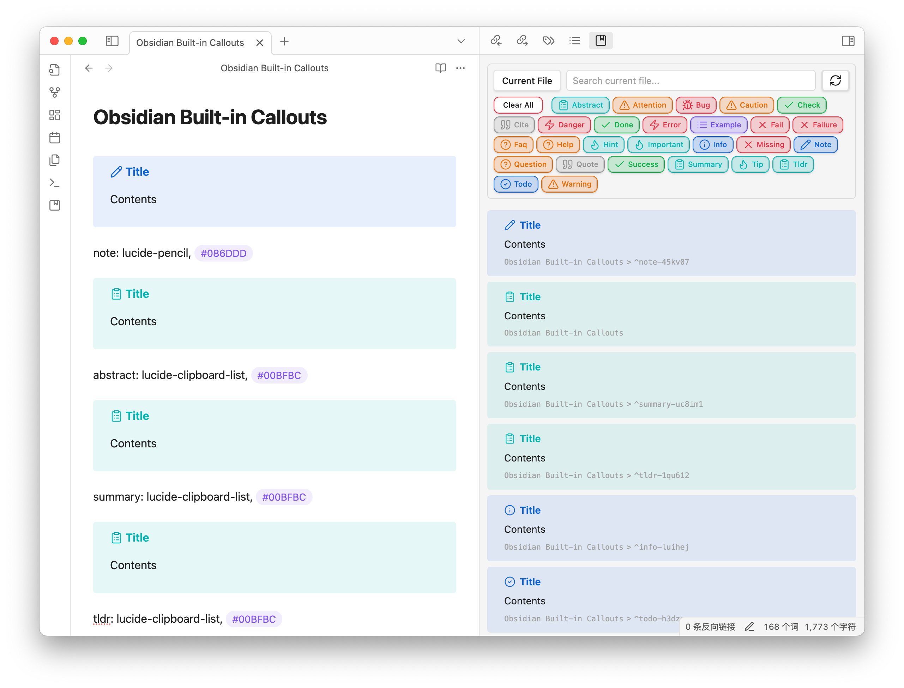
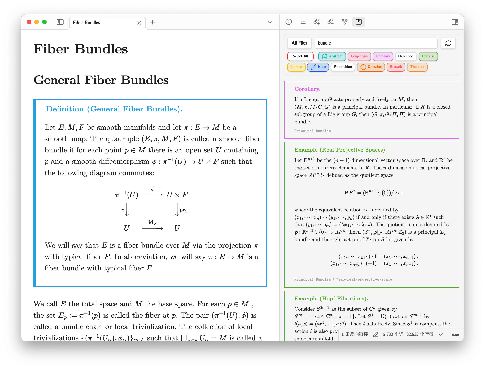
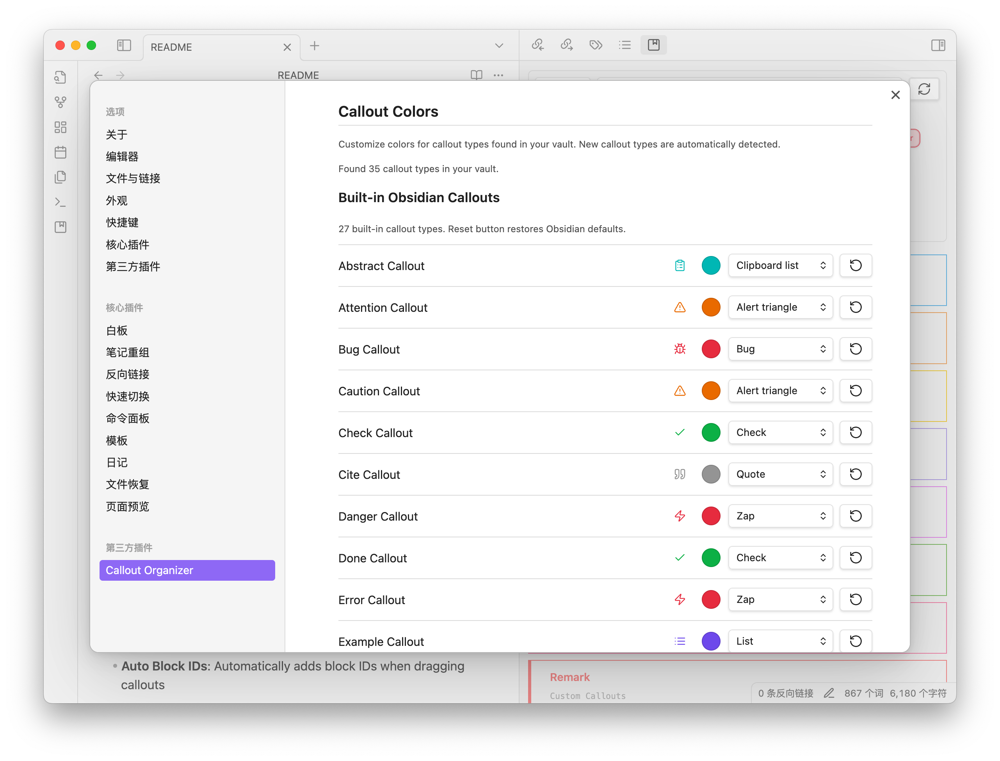

# Callout Organizer for Obsidian



A powerful plugin for organizing, searching, navigating, and citing callouts across your Obsidian vault. Thanks to Claude Code. These codes are all generated by Claude Code.

<div align=center>

</div>

## Features

### 🎯 Smart Callout Organization
- **Current File View**: See all callouts in the currently active file
- **Vault-Wide Search**: Search callouts across your entire vault with file caching
- **Type Filtering**: Filter callouts by type with visual buttons
- **Search Integration**: Find callouts by title, content, filename, headers, or block IDs
- **File Caching**: Intelligently caches callout data for faster search performance



### 🎨 Visual Customization
- **Color Customization**: Customize colors and icons for any callout type
- **Built-in Support**: Automatic detection of Obsidian's built-in callout types
- **Custom Callouts**: Automatic detection of custom callout types
- **CSS Support:** Add your own CSS snippets


### 🧭 Enhanced Navigation
- **One-Click Navigation**: Click any callout to jump to its location
- **Breadcrumb Navigation**: File > Header > Block ID hierarchy

### 🚀 Drag & Drop
- **Link Generation**: Drag callouts to create links automatically
- **Embed Support**: Option to create embed links (`![[...]]`) or regular links
- **Auto Callout IDs**: Automatically adds callout IDs when dragging callouts
- **Hide File Names**: Option to hide filenames in links using aliases (e.g., `[[file#^id|id]]`)

## Installation

### Install Manually

1. Create a new folder named `callout-organizer` in the directory `.obsidian/plugins`
2. Download the plugin files `main.js`, `styles.css`, `manifest.json` and add them to the folder `.obsidian/plugins/callout-organizer`
3. Reload Obsidian or restart the app
4. Enable the plugin in Settings > Community Plugins
5. Access via the ribbon icon or command palette

## Usage

### Getting Started
1. **Open the Plugin**: Click the album icon in the ribbon or use `Cmd/Ctrl + P` → "Open Callout Organizer"
2. **Switch Modes**: Toggle between "Current File" and "All Files" using the mode button
3. **Filter Types**: Click callout type buttons to show/hide specific types
4. **Search**: Use the search box to find specific callouts

### Navigation
- **Click to Jump**: Click any callout to navigate to its location
- **Breadcrumb Links**: Click filename, headers, or block IDs in the breadcrumb to jump
- **Ctrl/Cmd + Click**: Open in a new tab

### Drag & Drop
- **Create Links**: Drag any callout to your editor to create a link
- **Block IDs**: Block IDs are automatically generated when needed
- **Embed Mode**: Toggle embed links in settings for `![[...]]` vs `[[...]]` format
- **Hidden Filenames**: Enable "Hide file names in links" to create cleaner links with aliases

## Potential Problems

### Callout Standards

Callouts you created should follow the following standards:

```markdown
> [!note] Title
> Contents
> ^callout-id
```

But the original Obsidian block id created automatically is like:

```markdown
> [!note] Title
> Contents

^callout-id
```

The plugin will recognized the second one as a callout without ID.

### Math Block Formulas in Callouts

Math formulas in callouts should follow the following standards:

```markdown
> [!note] Title
> This is an identity matrix.
> $$\begin{pmatrix} 1 & 0 & 0 \\ 0 & 1 & 0 \\ 0 & 0 & 1 \end{pmatrix}$$
```

You should avoid using:

```markdown
> [!note] Title
> This is an identity matrix.
> $$
> \begin{pmatrix}
> 1 & 0 & 0\\
> 0 & 1 & 0\\
> 0 & 0 & 1
> \end{pmatrix}
> $$
```

In the second case, the auto callout IDs will not function properly.

### Callouts in Code Blocks

You may have some callouts in code blocks somewhere. These callouts can also be found in the callout organizer. But when dragging it into the document, the callout will not be found since it is in the code block.

### Missing Callouts

Some old callouts created before using this plugin can not be searched in this plugin. You can solve this problem by changing the filename to ensure the plugin tracking your callouts.

### Cache Management

The plugin uses intelligent file caching to improve search performance:

- **Cache Location**: Stored as `callouts.json` in the plugin folder (`.obsidian/plugins/callout-organizer/`)
- **Auto-Invalidation**: Cache is automatically refreshed when files are modified
- **Manual Refresh**: Use the refresh button in Search mode to force cache rebuild
- **Cache Settings**: Can be disabled in plugin settings if needed

**Cache Troubleshooting**:
- If callouts are missing, try clicking the refresh button in Search mode
- Check that "Enable file cache" is turned on in settings
- Cache automatically rebuilds when files change, but manual refresh may be needed after major vault changes

## Settings

### Display Options
- **Font Sizes**: Adjust callout content and breadcrumb font sizes
- **Header Levels**: Show/hide specific header levels (H1-H6)
- **Filenames & IDs**: Toggle display of filenames and block IDs

### Search Configuration
- **Excluded Folders**: Skip specific folders in vault-wide search
- **Search Fields**: Enable/disable searching in different content areas
- **Result Limits**: Control maximum number of search results
- **File Cache**: Enable/disable file caching for faster search performance

### Callout Customization
- **Colors**: Customize colors for any callout type
- **Icons**: Choose from 150+ Lucide icons
- **Custom CSS**: Add custom styling rules

Here is the recommended CSS snippet for the picture at the beginning of this document.

```css
--callout-border-opacity: 1;
--callout-radius: 0;
--callout-border-width: 0.1em;
background-color: var(--background-primary);
border-color: rgba(var(--callout-color), var(--callout-border-opacity));
border-left-width: 0.3em;
```

Here are the recommended colors of my custom callouts:

<div style="font-weight: bold;color: rgb(255,102,153)">RGB for conjecture is 255, 102, 153</div>
<div style="font-weight: bold;color: rgb(46,168,229)">RGB for definition is 255, 102, 153</div>
<div style="font-weight: bold;color: rgb(241,152,55)">RGB for theorem is 241, 152, 55</div>
<div style="font-weight: bold;color: rgb(255,102,102)">RGB for remark is 255, 102, 102</div>
<div style="font-weight: bold;color: rgb(95,178,54)">RGB for exercise is 95, 178, 54</div>
<div style="font-weight: bold;color: rgb(162,138,229)">RGB for proposition is 162, 138, 229</div>
<div style="font-weight: bold;color: rgb(245,202,0)">RGB for conjecture is 245, 202, 0</div>
<div style="font-weight: bold;color: rgb(229,110,238)">RGB for corollary is 229, 110, 238</div>

The inspiration of this color scheme comes from Zotero and Bilibili.

## License

MIT License - see LICENSE file for details

## Changelog

### Version 1.5.0
- 🎯 **Major Canvas Enhancement & Bug Fixes**:
  - **Edge Label Preservation**: Canvas edge labels are now preserved and restored across canvas regenerations
  - **Node Dimension Preservation**: Canvas node width/height are maintained across updates for consistent layouts
  - **Cross-Canvas Consistency**: Edge labels and node dimensions remain consistent across all canvas files
  - **Dual-Node Processing**: Fixed critical issue where callouts with both file and text nodes only processed one type
- 🎨 **Advanced Arrow Pattern System**:
  - **Circular Bidirectional Arrows**: Redesigned bidirectional connection visual pattern for enhanced clarity
    - Forward edges: right-to-right side connections (A→B)
    - Reverse edges: left-to-left side connections (B→A)
    - Creates elegant circular arrow patterns for bidirectional relationships
  - **Self-Connection Filtering**: Removed meaningless self-referential edges
    - Callouts linking to themselves no longer create canvas edges
    - Cleaner, more meaningful canvas visualizations
    - Improved navigation clarity and reduced visual clutter
- ⚡ **Performance & Stability Improvements**:
  - **ResizeObserver Error Fix**: Eliminated repetitive "ResizeObserver loop completed" console errors
    - Replaced nested setTimeout with requestAnimationFrame for better browser synchronization
    - Added global error suppression for cleaner console output
  - **Enhanced Canvas Analysis**: Improved canvas edge parsing and relationship detection accuracy
  - **Optimized Edge Creation**: More efficient bidirectional edge generation logic
- 🔧 **Technical Enhancements**:
  - **Global Edge Label System**: Implemented cross-canvas label consistency mechanism
  - **Node Dimension Tracking**: Added `canvasWidth` and `canvasHeight` fields to CalloutItem interface
  - **Improved Edge Processing**: Enhanced dual-node edge collection for complete relationship mapping
  - **Better Build Process**: Streamlined TypeScript compilation and plugin building workflow
- 🚀 **User Experience Improvements**:
  - **Cleaner Canvas Visualizations**: Removed clutter from self-referential connections
  - **Consistent Visual Patterns**: Standardized arrow directions for better relationship understanding
  - **Preserved User Customizations**: Canvas modifications (labels, sizes) persist across refreshes
  - **Enhanced Navigation**: More intuitive connection patterns for complex relationship maps

### Version 1.4.0
- 🎯 **Major Canvas Connection Enhancement**:
  - **Canvas-Based Connection Detection**: Completely redesigned connection detection to use canvas edges instead of text-based links
  - **Enhanced Canvas Integration**: Connections now established through canvas arrows rather than callout text references
  - **Intelligent Edge Direction Detection**: Smart parsing of canvas edge data with automatic direction detection based on node positions
- 🎨 **New Left-Right Layout Algorithm**:
  - **Systematic Layout Paradigm**: Implemented predictable left-right-vertical arrangement patterns for graph visualization
  - **Inlinks Positioning**: Nodes pointing to center → positioned on left side
  - **Outlinks Positioning**: Nodes from center → positioned on right side
  - **Bidirectional Layout**: Bidirectional connections → arranged vertically (top/bottom)
- 🧪 **Comprehensive Algorithm Testing**:
  - **67 Algorithm Test Scenarios**: Created complete test coverage for all connection patterns
  - **7 Algorithm Categories**: Including cycles, stars, fans, diamonds, and complex structures
  - **Built-in Callout Compatibility**: Uses only Obsidian built-in callout types for maximum compatibility
  - **Auto-Generated Canvas Files**: Automatically created canvas files for each test scenario
- ⚡ **Technical Improvements**:
  - **Enhanced Canvas Parsing**: Direct canvas edge analysis for precise relationship detection
  - **Improved Node Positioning**: Systematic coordinate calculation for optimal visual layouts
  - **Streamlined Connection Logic**: Focused on direct connections through canvas arrows
  - **Better Edge Classification**: Intelligent categorization of unidirectional vs bidirectional relationships
- 🚀 **User Experience Enhancements**:
  - **Visual Layout Consistency**: Predictable and intuitive arrangement patterns
  - **Algorithm Test Coverage**: Comprehensive testing scenarios for all graph patterns
  - **Canvas Integration**: Seamless integration with Obsidian's native canvas functionality

### Version 1.3.0
- 🏗️ **Major Architectural Improvements**:
  - **Simplified Relationship Model**: Removed inlinks/outlinks redundancy - now uses only outlinks for cleaner data structure
  - **Precise Canvas Control**: Enhanced canvas relationship management to process only specific fromNode edges based on canvas filename
  - **Smart Canvas Analysis**: Added `extractCalloutFromCanvasName()` function with format `callout-{filename}-{calloutID}.canvas`
- 🎨 **Enhanced Visual Design**:
  - **Circular Bidirectional Connections**: Redesigned double-arrow connections to use elegant circular paths (right→right, left→left)
  - **Improved Layout**: Bidirectional nodes now positioned vertically (top-bottom) for better visual appeal
  - **Beautiful Loop Visualization**: Creates intuitive circular representation of bidirectional relationships
- ⚡ **Technical Optimizations**:
  - **Streamlined Interface**: Removed `inlinks` property from `CalloutItem` interface
  - **Enhanced Graph Logic**: Updated `getRelatedCallouts()` to compute inlinks dynamically from outlinks
  - **Optimized Canvas Processing**: Canvas analysis focuses on specific relationship ownership per file
  - **Better Relationship Detection**: Improved bidirectional relationship categorization in graph view
- 🚀 **User Experience Improvements**:
  - **Precise Relationship Control**: Delete specific relationships by editing corresponding canvas files
  - **Cleaner Data Model**: Reduced redundancy while maintaining full functionality
  - **Enhanced Graph Visualization**: More intuitive and aesthetically pleasing connection patterns

### Version 1.2.3
- 🚀 **Performance Improvements**:
  - **Major Cache Optimization**: Fixed critical performance issue where cache was loaded multiple times during refresh (once per file). Now loads cache only once, dramatically improving performance for large vaults
  - **Async File Operations**: Replaced blocking Node.js `fs.readFileSync/writeFileSync` with Obsidian's async vault adapter, eliminating UI freezing during file operations
  - **DOM Caching**: Added intelligent DOM element caching to reduce repeated queries and improve rendering performance
- 🔒 **Reliability Enhancements**:
  - **Race Condition Protection**: Added cache operation locking to prevent concurrent operations from corrupting data
  - **Input Validation**: Added JSON validation before parsing cache files, gracefully handling corrupted cache
  - **Memory Leak Prevention**: Enhanced cleanup procedures in `onunload()` method to prevent memory accumulation
- 🛠️ **Technical Improvements**:
  - **Better Error Handling**: Improved error handling patterns throughout the codebase
  - **Code Quality**: Enhanced TypeScript safety and removed potential null reference issues
  - **Architecture**: Better separation of concerns with cleaner async operation management
- 🐛 **Bug Fixes**:
  - Fixed potential infinite loops in regex operations
  - Resolved DOM element cleanup issues
  - Enhanced cache consistency and validation

### Version 1.2.1
- 🐛 **Bug Fixes**:
  - Fixed sorting in search mode to properly show recently modified callouts at the top
  - Enhanced cache loading to respect modification time ordering
  - Improved sort logic with better fallback mechanisms for callouts without modification times
- 🔧 **Technical Improvements**:
  - Updated cache loading logic to apply sorting when retrieving cached callouts
  - Enhanced sorting robustness with fallback chain: `calloutModifyTime` → `fileModTime` → default timestamp
  - Fixed both grouped and ungrouped callout rendering to use consistent sorting

### Version 1.2.0
- 🎉 **Major New Features**:
  - **Smart Time Tracking**: Added intelligent creation and modification time tracking for callouts
  - **Human-Readable Timestamps**: All times now use YYYY-MM-DD HH:mm:ss format instead of Unix timestamps
  - **Intelligent Change Detection**: Only updates modification times when callout content actually changes
  - **Improved calloutID System**: Renamed blockId to calloutID for better semantic clarity
  - **Smart File Change Handling**: Distinguishes between file changes and actual callout content changes
- ✨ **Enhanced Time Logic**:
  - **Callouts with IDs**: Robust time tracking that preserves creation times and only updates modification times when content changes
  - **Callouts without IDs**: Synchronized with file modification times for logical behavior
  - **Backward Compatibility**: Automatically converts old timestamp formats to readable format
- 🔧 **Technical Improvements**:
  - Added smart caching with content comparison for better performance
  - Enhanced cache validation with file modification time checks
  - Improved callout identification using file + calloutID signatures
  - Better error handling and type safety throughout the codebase
- 🐛 **Bug Fixes**:
  - Fixed null/undefined property access issues
  - Improved error handling in math rendering
  - Enhanced type checking for better reliability
  - Fixed sorting functions to work with new readable timestamp format

### Version 1.1.1
- 🐛 **Bug Fixes**:
  - Fixed search functionality to properly detect callouts in all files
  - Resolved issue where some callouts weren't found in search mode
- ✨ **Improvements**:
  - Search mode now always includes callouts from the current file
  - Enhanced file processing reliability with better caching logic
  - Improved search algorithm to ensure no files are skipped

### Version 1.1.0
- 🎉 **New Feature**:
  - **Hide File Names in Links**: New drag option to create cleaner links with aliases
  - When enabled, dragged callouts generate links like `[[filename#^theorem-def456|theorem-def456]]`
  - Uses actual callout ID as alias for better readability
  - Works with both regular and embed links
- 🔧 **Code Improvements**:
  - Optimized filename extraction logic
  - Enhanced drag functionality performance
  - Updated setting descriptions for clarity

### Version 1.0.1
- 🐛 **Bug Fixes**:
  - Fixed callout icons displaying correctly
  - Fixed callout title colors using proper callout colors
  - Fixed note callout icon to use correct `lucide-pencil`
  - Fixed toggle button width preventing layout shifts
  - Fixed icon base size for better visual proportions (16px)
- ✨ **Improvements**:
  - Moved breadcrumbs to bottom for better organization
  - Enhanced visual layout and spacing
  - Improved code consistency and performance

### Version 1.0.0
- 🎉 **Initial Release**
- ✨ **New Features**:
  - Responsive icon sizing
  - Cursor centering on navigation
  - Enhanced color handling
  - Drag & drop link creation
- 🔧 **Improvements**:
  - Simplified folder filtering (exclude-only)
  - Better default settings
  - Improved code consistency
- 🐛 **Bug Fixes**:
  - Fixed note callout icon
  - Resolved title color issues
  - Better icon sizing

---

**Made with ❤️ for the Obsidian community**
