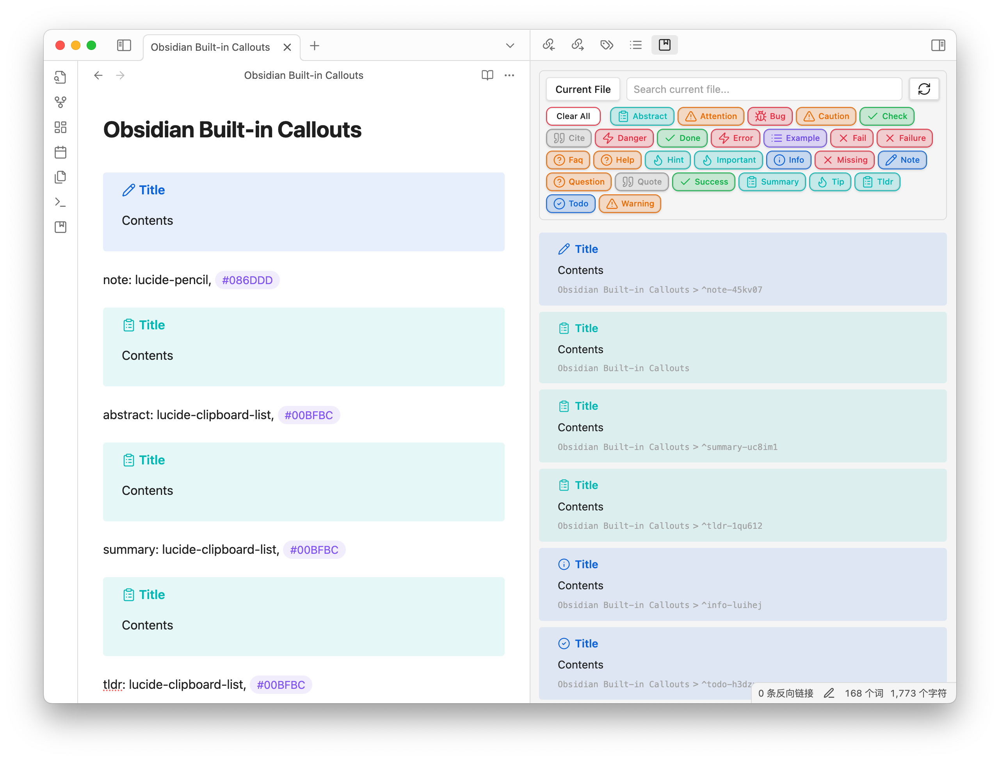
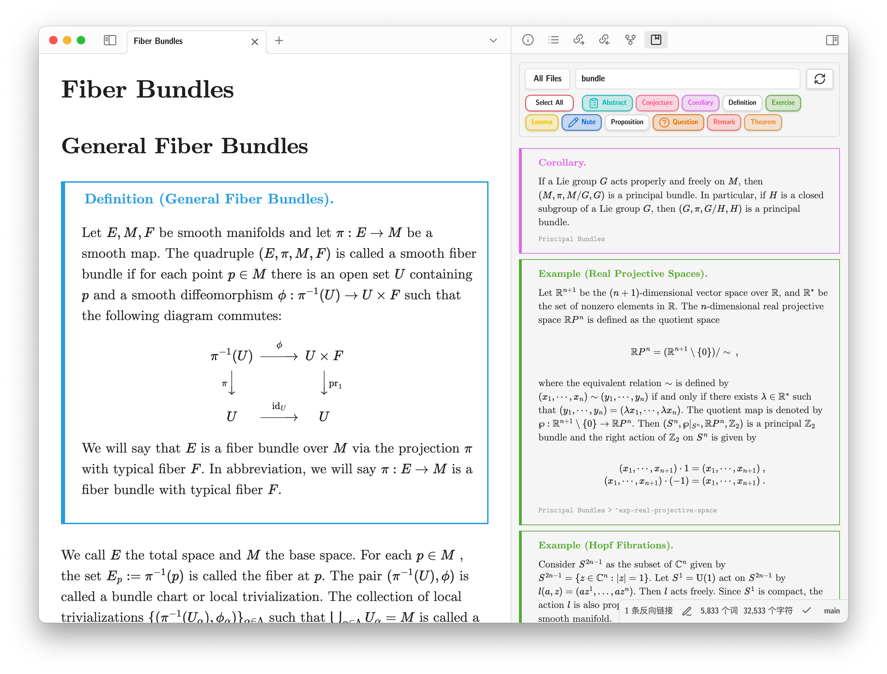
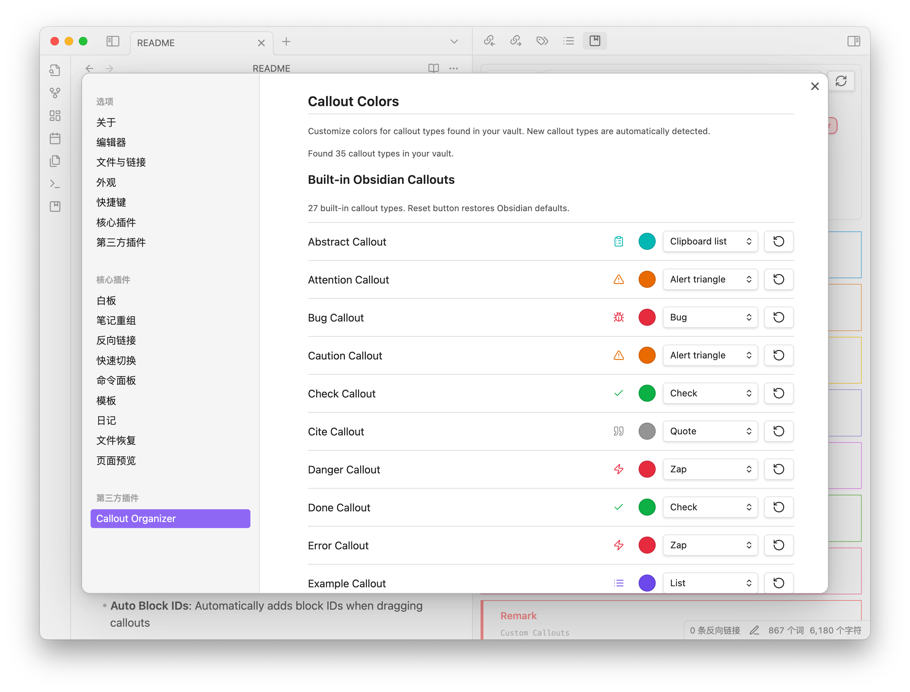

# Callout Organizer for Obsidian



A powerful plugin for organizing, searching, navigating, and citing callouts across your Obsidian vault. Thanks to Claude Code. These codes are all generated by Claude Code.

<div align=center>

</div>

## Features

### 🎯 Smart Callout Organization
- **Current File View**: See all callouts in the currently active file
- **Vault-Wide Search**: Search callouts across your entire vault
- **Type Filtering**: Filter callouts by type with visual buttons
- **Search Integration**: Find callouts by title, content, filename, headers, or block IDs



### 🎨 Visual Customization
- **Color Customization**: Customize colors and icons for any callout type
- **Built-in Support**: Automatic detection of Obsidian's built-in callout types
- **Custom Callouts**: Automatic detection of custom callout types
- **CSS Support:** Add your own CSS snippets


### 🧭 Enhanced Navigation
- **One-Click Navigation**: Click any callout to jump to its location
- **Breadcrumb Navigation**: File > Header > Block ID hierarchy

### 🚀 Drag & Drop
- **Link Generation**: Drag callouts to create links automatically
- **Embed Support**: Option to create embed links (`![[...]]`) or regular links
- **Auto Callout IDs**: Automatically adds callout IDs when dragging callouts

## Installation

### Install Manually

1. Create a new folder named `callout-organizer` in the directory `.obsidian/plugins`
2. Download the plugin files `main.js`, `styles.css`, `manifest.json` and add them to the folder `.obsidian/plugins/callout-organizer`
3. Reload Obsidian or restart the app
4. Enable the plugin in Settings > Community Plugins
5. Access via the ribbon icon or command palette

## Usage

### Getting Started
1. **Open the Plugin**: Click the album icon in the ribbon or use `Cmd/Ctrl + P` → "Open Callout Organizer"
2. **Switch Modes**: Toggle between "Current File" and "All Files" using the mode button
3. **Filter Types**: Click callout type buttons to show/hide specific types
4. **Search**: Use the search box to find specific callouts

### Navigation
- **Click to Jump**: Click any callout to navigate to its location
- **Breadcrumb Links**: Click filename, headers, or block IDs in the breadcrumb to jump
- **Ctrl/Cmd + Click**: Open in a new tab

### Drag & Drop
- **Create Links**: Drag any callout to your editor to create a link
- **Block IDs**: Block IDs are automatically generated when needed
- **Embed Mode**: Toggle embed links in settings for `![[...]]` vs `[[...]]` format

## Potential Problems

### Callout Standards

Callouts you created should follow the following standards:

```markdown
> [!note] Title
> Contents
> ^callout-id
```

But the original Obsidian block id created automatically is like:

```markdown
> [!note] Title
> Contents

^callout-id
```

The plugin will recognized the second one as a callout without ID.

### Math Block Formulas in Callouts

Math formulas in callouts should follow the following standards:

```markdown
> [!note] Title
> This is an identity matrix.
> $$\begin{pmatrix} 1 & 0 & 0 \\ 0 & 1 & 0 \\ 0 & 0 & 1 \end{pmatrix}$$
```

You should avoid using:

```markdown
> [!note] Title
> This is an identity matrix.
> $$
> \begin{pmatrix}
> 1 & 0 & 0\\
> 0 & 1 & 0\\
> 0 & 0 & 1
> \end{pmatrix}
> $$
```

In the second case, the auto callout IDs will not function properly.

## Settings

### Display Options
- **Font Sizes**: Adjust callout content and breadcrumb font sizes
- **Header Levels**: Show/hide specific header levels (H1-H6)
- **Filenames & IDs**: Toggle display of filenames and block IDs

### Search Configuration
- **Excluded Folders**: Skip specific folders in vault-wide search
- **Search Fields**: Enable/disable searching in different content areas
- **Result Limits**: Control maximum number of search results

### Callout Customization
- **Colors**: Customize colors for any callout type
- **Icons**: Choose from 150+ Lucide icons
- **Custom CSS**: Add custom styling rules

Here is the recommended CSS snippet for the picture at the beginning of this document.

```css
--callout-border-opacity: 1;
--callout-radius: 0;
--callout-border-width: 0.1em;
background-color: var(--background-primary);
border-color: rgba(var(--callout-color), var(--callout-border-opacity));
border-left-width: 0.3em;
```

Here are the recommended colors of my custom callouts:

<div style="font-weight: bold;color: rgb(255,102,153)">RGB for conjecture is 255, 102, 153</div>
<div style="font-weight: bold;color: rgb(46,168,229)">RGB for definition is 255, 102, 153</div>
<div style="font-weight: bold;color: rgb(241,152,55)">RGB for theorem is 241, 152, 55</div>
<div style="font-weight: bold;color: rgb(255,102,102)">RGB for remark is 255, 102, 102</div>
<div style="font-weight: bold;color: rgb(95,178,54)">RGB for exercise is 95, 178, 54</div>
<div style="font-weight: bold;color: rgb(162,138,229)">RGB for proposition is 162, 138, 229</div>
<div style="font-weight: bold;color: rgb(245,202,0)">RGB for conjecture is 245, 202, 0</div>
<div style="font-weight: bold;color: rgb(229,110,238)">RGB for corollary is 229, 110, 238</div>

The inspiration of this color scheme comes from Zotero and Bilibili.

## License

MIT License - see LICENSE file for details

## Changelog

### Version 1.0.1
- 🐛 **Bug Fixes**:
  - Fixed callout icons displaying correctly
  - Fixed callout title colors using proper callout colors
  - Fixed note callout icon to use correct `lucide-pencil`
  - Fixed toggle button width preventing layout shifts
  - Fixed icon base size for better visual proportions (16px)
- ✨ **Improvements**:
  - Moved breadcrumbs to bottom for better organization
  - Enhanced visual layout and spacing
  - Improved code consistency and performance

### Version 1.0.0
- 🎉 **Initial Release**
- ✨ **New Features**:
  - Responsive icon sizing
  - Cursor centering on navigation
  - Enhanced color handling
  - Drag & drop link creation
- 🔧 **Improvements**:
  - Simplified folder filtering (exclude-only)
  - Better default settings
  - Improved code consistency
- 🐛 **Bug Fixes**:
  - Fixed note callout icon
  - Resolved title color issues
  - Better icon sizing

---

**Made with ❤️ for the Obsidian community**
